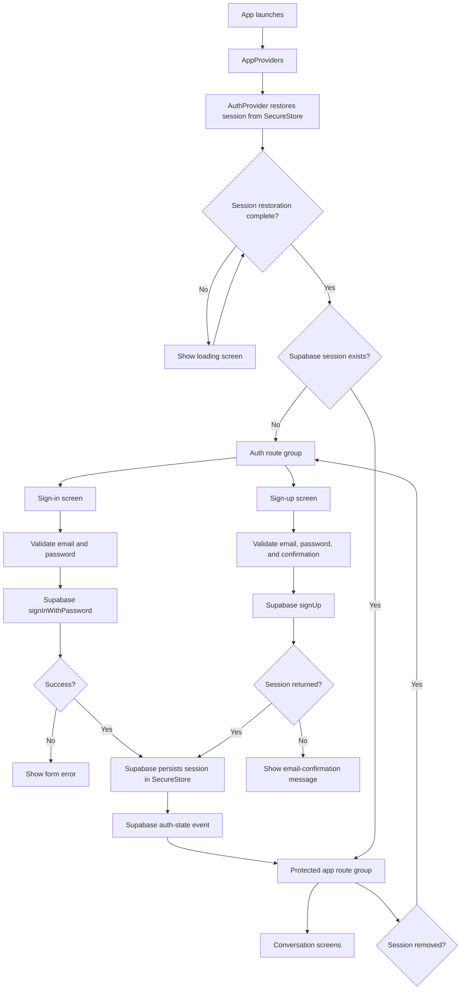

# Authentication and protected routing

This flow documents the current Expo Router and Supabase session behaviour. It does not include the email-confirmation deep link, which remains unimplemented.

## Route guard rules

- `src/app/index.tsx` redirects to `/(app)` when a session exists, otherwise to `/(auth)/sign-in`.
- `src/app/(app)/_layout.tsx` redirects unauthenticated users to sign-in.
- `src/app/(auth)/_layout.tsx` redirects authenticated users to `/(app)`.
- `AuthProvider` listens for Supabase auth-state changes, so route guards react after sign-in, sign-up with a session, or sign-out.
- Supabase stores the session through the SecureStore adapter in `src/lib/auth/secure-storage.ts`.
