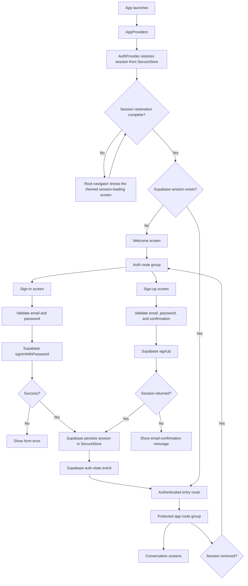

# Authentication and protected routing

This flow documents the current Expo Router and Supabase session behaviour. It does not include the email-confirmation deep link, which remains unimplemented.

## Route guard rules

- `src/app/_layout.tsx` holds the navigator until the initial Supabase session check finishes. Route screens do not mount behind the loading surface.
- `src/app/index.tsx` redirects to the authenticated entry route when a session exists, otherwise to Welcome.
- `src/app/(app)/_layout.tsx` redirects a user whose session expires to sign-in.
- `src/app/(auth)/_layout.tsx` sends an authenticated user through the same authenticated entry route used at launch.
- `src/features/auth/routes.ts` owns these destinations. The authenticated entry remains `/(app)` until profile-based onboarding routing replaces the transitional conversation screen.
- `AuthProvider` listens for Supabase auth-state changes, so route guards react after sign-in, sign-up with a session, or sign-out.
- Supabase stores the session through the SecureStore adapter in `src/lib/auth/secure-storage.ts`.

## Development preview exception

The root layout exposes `/design-system` through `Stack.Protected` with a `__DEV__` guard. The screen also redirects to `/` outside development. It sits outside the auth/app route groups, so developers can open it before or after sign-in using **Open Design System · Dev**.

The preview uses local sample data and an isolated ThemeProvider. It does not grant access to authenticated feature screens or change session state. Close it to return to the previous screen. Production builds have no preview launcher or route access.

Welcome and password authentication use the approved design system. Preferred name, conversation style, and onboarding-completion persistence are the next UI integration work.
