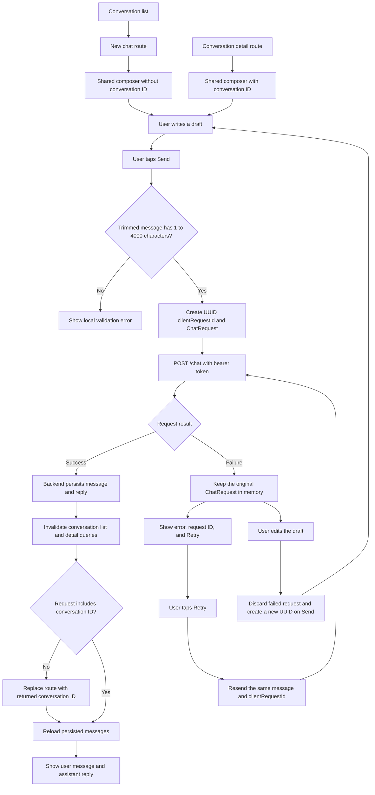

# Chat: new chat, send, failure, and retry

The current chat API is request-and-response. The app waits for the completed reply; it does not stream tokens.

## Reliability rules

- `useChatComposer` creates a UUID before the first request and retains the complete `ChatRequest` after failure.
- Retry reuses the same `clientRequestId`. The backend uses it to replay a completed result or reject concurrent processing without creating a duplicate message.
- Editing a failed draft discards its pending request. The next send creates a new UUID.
- `useSendChatMessage` disables TanStack Query automatic mutation retry. The user chooses when to retry.
- On a successful new chat, the app routes to `/conversations/:conversationId`. On a successful existing-conversation send, the app refreshes its messages.
- Device-persisted drafts and pending requests are not implemented yet.
