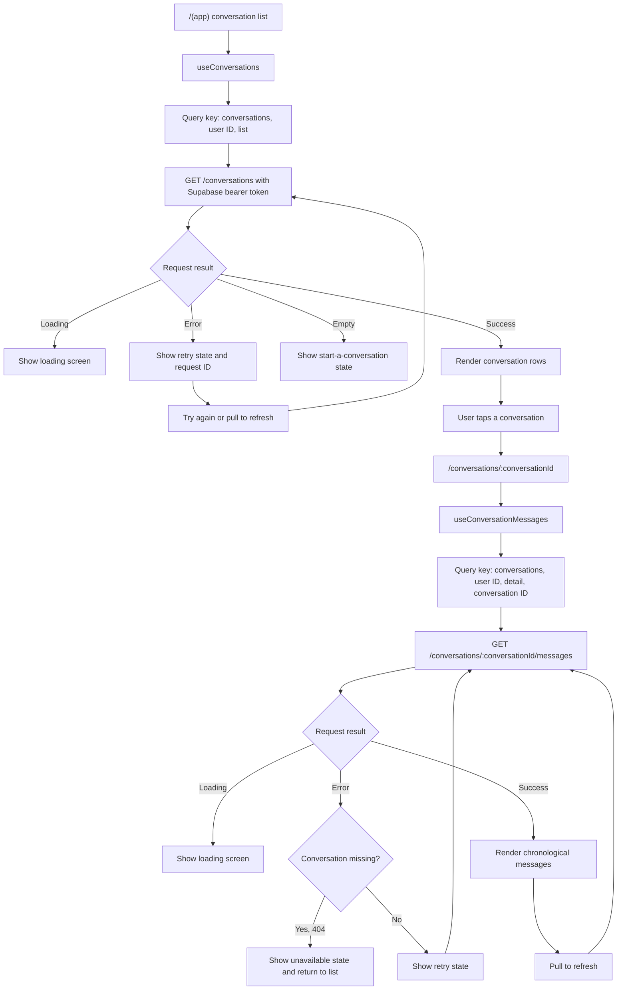

# Conversations: list to detail

This flow covers server-backed conversation browsing. TanStack Query keeps the in-memory cache scoped to the authenticated user. SQLite caching is later work.

## Implementation notes

- `src/features/conversations/hooks.ts` separates list and detail caches by user ID and conversation ID.
- `src/app/(app)/index.tsx` calls `GET /conversations`, renders loading, empty, error, and refresh states, then routes to the selected conversation.
- `src/app/(app)/conversations/[conversationId].tsx` calls `GET /conversations/{conversationId}/messages` and renders messages in API order.
- A `CONVERSATION_NOT_FOUND` error returns the user to the list. The backend hides conversations that do not belong to the authenticated user.
- Conversation titles currently fall back to “Conversation” because the current API returns `title: null`.
