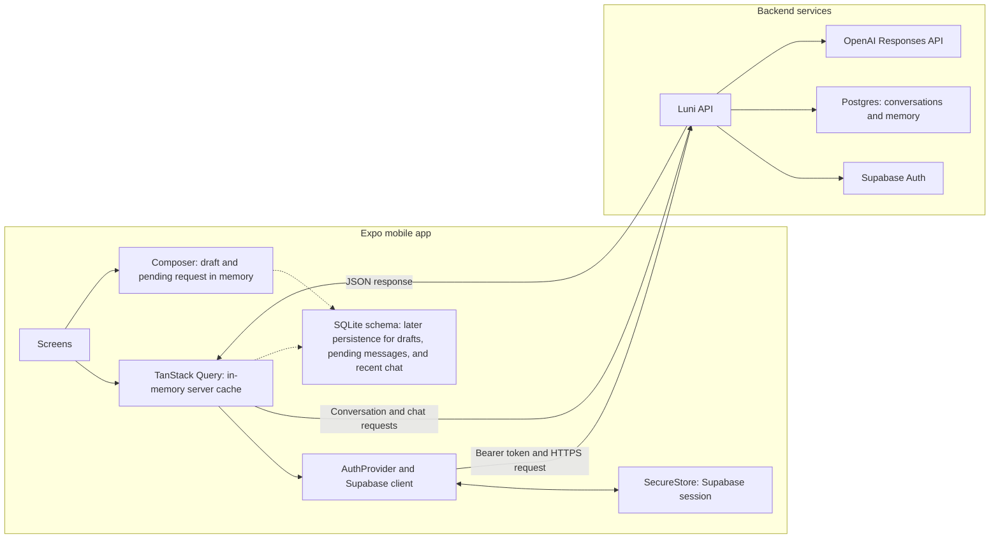

# Data ownership and caching

The Luni API owns persisted conversations and memory. The mobile app stores only session credentials and temporary client state.

## Ownership rules

| Data | Owner | Current mobile storage |
| --- | --- | --- |
| Supabase session | Supabase Auth | `expo-secure-store` |
| Conversations and messages | Luni API and Postgres | TanStack Query memory cache |
| Memory records and rules | Luni API and Postgres | None |
| Drafts and pending messages | Mobile client | Composer state; SQLite persistence is pending |
| Recent chat cache | Mobile client copy of server data | SQLite schema exists; reads and writes are pending |

## Implementation notes

- The client sends the Supabase access token to the Luni API. It does not access Postgres or OpenAI directly.
- TanStack Query caches list and detail responses by user ID and conversation ID. Its cache does not survive an app restart.
- SQLite migrations create tables for drafts, pending messages, cached conversations, and cached messages. Current screens do not read or write those tables.
- The backend remains the source of truth. The app must reconcile local drafts and cached data with backend responses when persistence is added.
