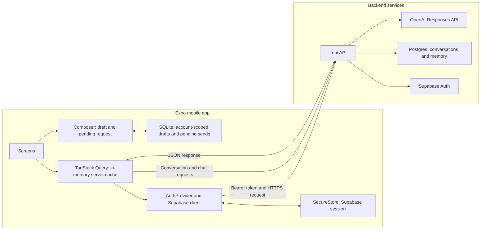

# Data ownership and caching

The Luni API owns persisted conversations and memory. The mobile app stores only session credentials and temporary client state.

## Ownership rules

| Data | Owner | Current mobile storage |
| --- | --- | --- |
| Supabase session | Supabase Auth | `expo-secure-store` |
| Conversations and messages | Luni API and Postgres | TanStack Query memory cache |
| Memory records and rules | Luni API and Postgres | None |
| Drafts and pending messages | Mobile client | Account-scoped SQLite rows plus active composer state |
| Recent chat cache | Mobile client copy of server data | SQLite schema exists; reads and writes are pending |

## Implementation notes

- The client sends the Supabase access token to the Luni API. It does not access Postgres or OpenAI directly.
- TanStack Query caches companion responses by user ID. Its cache does not survive an app restart.
- SQLite stores drafts, selected quotes, immutable pending payloads, retry metadata, and confirmed user-message IDs by account. Signing out does not expose one account's data to another account.
- The chat screen loads server history before restoring a pending send. A matching confirmed message ID clears local pending state; without one, the app offers the original idempotent request for retry.
- Cached conversation/message tables remain unused. The backend remains the source of truth for conversation history.
